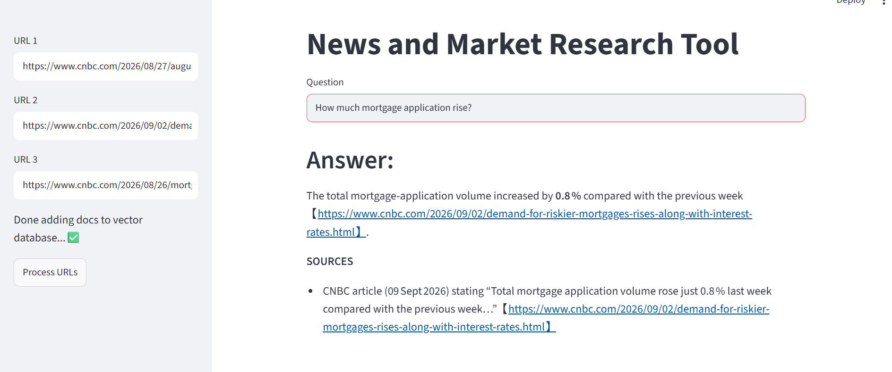

# 🏙️ News and Market Research Tool

A user-friendly research tool designed for effortless information retrieval from news and market articles. Users can input article URLs and ask questions to receive relevant insights. (Its features can be extended to any domain.)

## Screenshot



## Features

- Load article URLs and scrape their content using `requests` + `BeautifulSoup`.
- Split article content into manageable chunks using LangChain's `RecursiveCharacterTextSplitter`.
- Construct embedding vectors using HuggingFace embeddings (`sentence-transformers/all-MiniLM-L6-v2`) and leverage ChromaDB as the vector store, to enable swift and effective retrieval of relevant information.
- Interact with the LLM (GPT-OSS 120B via Groq) by inputting queries and receiving answers along with source URLs.

## Setup

1. Clone this repository and navigate into the project folder.

2. Create a virtual environment (recommended) and activate it:
   ```bash
   python -m venv .venv
   .venv\Scripts\activate   # Windows
   source .venv/bin/activate  # macOS/Linux
   ```

3. Run the following command to install all dependencies:
   ```bash
   pip install -r requirements.txt
   ```

4. Copy `.env.example` to `.env` and add your own Groq API key:
```bash
   cp .env.example .env   # macOS/Linux
   copy .env.example .env # Windows
```
   Then edit `.env` and fill in your credentials.

5. Run the Streamlit app:
   ```bash
   streamlit run main.py
   ```

## Usage/Examples

The web app will open in your browser after the setup is complete.

- On the sidebar, you can input up to 3 URLs directly.
- Initiate the data loading and processing by clicking **"Process URLs."**
- Observe the system as it performs scraping, text splitting, and generates embedding vectors using HuggingFace's embedding model.
- The embeddings are stored in ChromaDB.
- You can now ask a question and get an answer based on those news articles, along with the source(s) used.


## Project Structure

```
News-Market-Research-Tool/
├── main.py              # Streamlit UI
├── rag.py                # Core RAG pipeline (scraping, embeddings, retrieval, LLM)
├── requirements.txt      # Python dependencies
├── .env.example           # Template for environment variables
├── .env                  # Your actual Groq API credentials (not committed, ignored via .gitignore)
└── resources/
    └── vectorstore/      # Persisted ChromaDB vector store
```

## Tech Stack

| Component | Tool/Library |
|---|---|
| Web Framework | Streamlit |
| LLM | GPT-OSS 120B via Groq |
| Embeddings | HuggingFace (`all-MiniLM-L6-v2`) |
| Vector Store | ChromaDB |
| Web Scraping | Requests + BeautifulSoup |
| Orchestration | LangChain |

## Notes

- The `resources/vectorstore` folder is created automatically if it doesn't exist.
- Each time "Process URLs" is run, the existing vector store collection is reset and repopulated with the newly provided URLs.
- Some websites may block automated scraping; if a URL fails to load, it will be flagged in the app.
- The `.env` file (containing your actual API key) is excluded via `.gitignore` and never committed. Use `.env.example` as a reference to set up your own credentials.